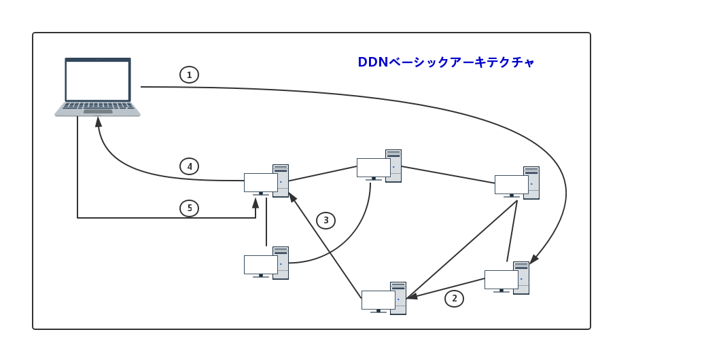
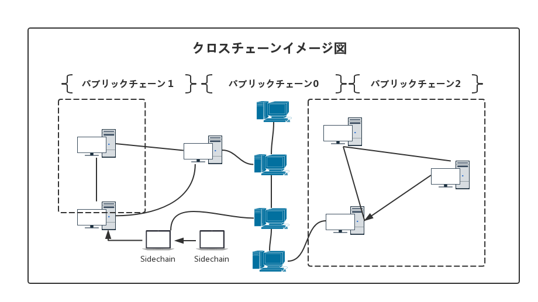
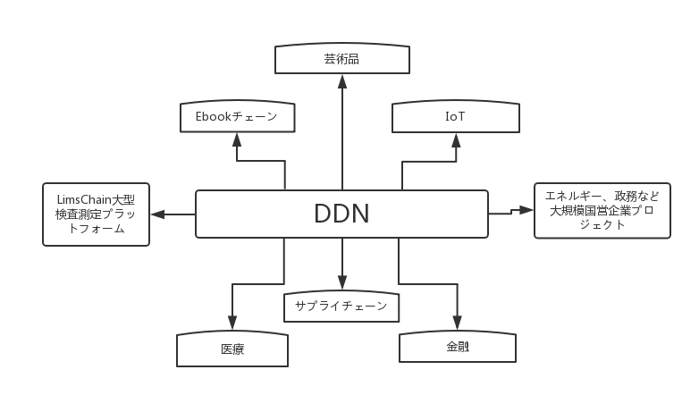

DDN白書
------

——企業向けブロックチェーンシステム

v1.0.0

DDNファウンデーション

2017年12月12日

## 内容説明
このドキュメントの内容は、V1.0.0のリリースを確定する前に何度か議論され、編集されている。 DDNネットワークの戦略目標と将来の開発ロードマップにフォーカスし、より多くの組織が高度な自治性を得るための方向と道を提示した。
DDNネット白書の最新バージョン、ロードマップ、チーム、ファウンデーション、パートナー、最新プロジェクトについては、公式のDDN Webサイトをご覧ください。

**公式リンク**
- DDN公式サイト：http://ddn.link
- DDNコアチェーンのメインネットワーク：http://mainnet.ddn.link
- DDNコアチェーンテストネットワーク：http://testnet.ddn.link
- DDNソースライブラリ：https://github.com/ddnlink
- DDN白書：https://github.com/ddnlink/whitepaper

**ソーシャルプラットフォーム**
- DDNテクノロジーコミュニティ：http://ddn.link/community
- DDN中国のコミュニティQQグループ：669624212;
- DDN WeChat ID：@DDN_link;
- DDN Weibo：@DDN_link;						
- DDN Twitter：@DDN_link;
- DDN中国語電信グループ：@ddnlinkCN;
- DDN英語電信グループ：@ddnlink;
- 電子メール：
    *ビジネス協力operation@ddn.link;
    *テクニカルサポートsupport@ddn.link;
    *人材募集hr@ddn.link

## 目次

<!-- TOC -->

- [内容説明](#内容説明)
- [目次](#目次)
- [1. 概要](#1-概要)
- [2. 名詞](#2-名詞)
- [3. ミッション](#3-ミッション)
- [4. 背景](#4-背景)
    - [4.1 インターネットの本来の意図は、リソースの相互接続](#41-インターネットの本来の意図はリソースの相互接続)
    - [4.2 ユーザーデータはユーザーに属すべき](#42-ユーザーデータはユーザーに属すべき)
    - [4.3 ブロックチェーンの核心は利益移転ルール](#43-ブロックチェーンの核心は利益移転ルール)
    - [4.4 企業の最終形は高度な自治](#44-企業の最終形は高度な自治)
- [5. 意義](#5-意義)
    - [5.1 ビジネス（または業界）の苦境を解決する](#51-ビジネスまたは業界の苦境を解決する)
    - [5.2 会社全体の業務効率を向上させる](#52-会社全体の業務効率を向上させる)
    - [5.3 市場シェアを拡大​​する](#53-市場シェアを拡大​​する)
    - [5.4 企業ブランド力を深める](#54-企業ブランド力を深める)
- [6. ベースアーキテクチャ](#6-ベースアーキテクチャ)
    - [6.1 アーキテクチャ図](#61-アーキテクチャ図)
    - [6.2 キーテクノロジー](#62-キーテクノロジー)
    - [6.3 主な特徴](#63-主な特徴)
        - [6.3.1 多重チェーンの並列](#631-多重チェーンの並列)
        - [6.3.2 モジュール化設計](#632-モジュール化設計)
        - [6.3.3 カスタマイズの見える化](#633-カスタマイズの見える化)
        - [6.3.4 複数端末の使用](#634-複数端末の使用)
- [7. コアテクノロジー](#7-コアテクノロジー)
    - [7.1 DDNブロックチェーン](#71-ddnブロックチェーン)
        - [7.1.1 コンセンサスメカニズム](#711-コンセンサスメカニズム)
        - [7.1.2 インセンティブメカニズム](#712-インセンティブメカニズム)
        - [7.1.3 受託者](#713-受託者)
        - [7.1.4 ポイントツーポイントネットワーク](#714-ポイントツーポイントネットワーク)
    - [7.2 サイドチェーン技術](#72-サイドチェーン技術)
        - [7.2.1 仮想マシン](#721-仮想マシン)
        - [7.2.2 Dapp開発](#722-dapp開発)
        - [7.2.3 Dapp演算](#723-dapp演算)
        - [7.2.4 DAPコンセンサスアルゴリズム](#724-dapコンセンサスアルゴリズム)
        - [7.2.5 Dappマスターノード](#725-dappマスターノード)
    - [7.3 クロスチェーン技術](#73-クロスチェーン技術)
        - [7.3.1 名前付きルーター](#731-名前付きルーター)
        - [7.3.2 スマートハードウェア](#732-スマートハードウェア)
        - [7.3.3 スマート資産](#733-スマート資産)
        - [7.3.4 スマートウォレット](#734-スマートウォレット)
- [8. アーキテクチャ的メリット](#8-アーキテクチャ的メリット)
    - [8.1 所有権の明確化](#81-所有権の明確化)
    - [8.2 高度なセキュリティ](#82-高度なセキュリティ)
    - [8.3 タイムリーレスポンス](#83-タイムリーレスポンス)
    - [8.4 最高の体験](#84-最高の体験)
    - [8.5 フレンドリーな開発](#85-フレンドリーな開発)
- [9. ビジネスと応用](#9-ビジネスと応用)
    - [9.1 ビジネス目標：ブロックチェーン展開を０コストにする](#91-ビジネス目標ブロックチェーン展開を０コストにする)
    - [9.2 応用見通し](#92-応用見通し)
        - [9.2.1 知的財産保護](#921-知的財産保護)
        - [9.2.2 ビッグデータ管理](#922-ビッグデータ管理)
        - [9.2.3 IoT](#923-iot)
        - [9.2.4 ヘルスケア](#924-ヘルスケア)
        - [9.2.5 政務管理](#925-政務管理)
        - [9.2.6 金融保険](#926-金融保険)
        - [9.2.7 企業管理](#927-企業管理)
- [10. テクノロジーインキュベーション](#10-テクノロジーインキュベーション)
    - [10.1 インキュベーション方式](#101-インキュベーション方式)
    - [10.2 典型的ケース](#102-典型的ケース)
        - [10.2.1 Ebookchain](#1021-ebookchain)
        - [10.2.2 LimsChain](#1022-limschain)
        - [10.2.3 芸術品管理システム](#1023-芸術品管理システム)
- [11. ロードマップ](#11-ロードマップ)
    - [11.1 第1段階](#111-第1段階)
    - [11.2 第二段階](#112-第二段階)
    - [11.3 第三段階](#113-第三段階)
    - [11.4 コミュニティの自治](#114-コミュニティの自治)
- [参照資料](#参照資料)

<!-- /TOC -->

## 1. 概要
DDNは英語 "Data Delivery Network"の略であり、新世代のデータ配信ネットワークであり、企業向けのブロックチェーン応用プラットフォームである。そのミッションは「優秀な企業をもっと優秀に」することである。 DDNネットワークは無数のオープンチェーン、アライアンスチェーンおよび独自のチェーンで構成されており、公開、透明、改竄不可の特徴をベースとして、ユーザーデータ資産を効果的に守り、データストレージ、プロセス最適化、スマート制御、金融決済など多くの面で大きな利点がある。独自なネットワークアドレッシングプロトコル、データ配信プロトコル、スマートハードウェアデバイスを通じて、ネットワークアドレッシング、ロードバランシング、およびデータ配信各ポイントでリアルタイムにユーザーのデマンドを最適なノードにリダイレクトされ、より速いデータ転送が可能になり、より良い体験を得る。モジュラー開発設計、見える化されたオペレーションのカスタマイズ、多重P2Pネットワーク補償アーキテクチャの採用により、開発と使用がより容易になる。この白書では、DDNの概念と由来について説明し、インターネット現状問題を分析し、具体的なソリューションを提案し、商業的な観点から開発のロードマップを提示した。

## 2. 名詞
**Data Delivery Network**，DDN、データ配信ネットワークは、DDNブロックチェーン技術をフルに活用し、基盤となるネットワークのストレージ、索引付け、検索、アドレス指定および配信にTCP / IP制限を突破し、データ伝送を最適化し、データに帰属と価値を持たせる。企業のプロセス最適化、変革とアップグレード、組織自治の達成、ブランドと市場への影響力拡大をサポートする。

**DDN Blockchain**，DDN Blockchain、DDNブロックチェーンは、ビットコイン、イーサなど従来の仮想通貨と一線を画す独立した第三のブロックチェーンプログラムであり、クロスチェーン、サイドチェーン技術を持ち、マルチチェーンの並列が可能。ユニークなモジュラー設計と見える化操作は、企業が独自のブロックチェーン製品を迅速にカスタマイズするのに役立つ。 

**Directional Data**，DD、定方向データはDDNネットワークの中で伝送されるデータであり、任意の従来形式、数値、テキスト、イメージ、オーディオおよびビデオを含む。従来のネットワークとは異なり、データのブロックチェーン証拠保存機能によって、生成した時点より所有権があり、将来の移転は完全に記録される。

**Data Transaction**，DT、データトランザクション、DDNネットワークの各ステップにおける全てのデータフローが取引行為である。デジタル世界では、デジタル形式の変更や転送は全て価値の表現若しくは転移があるべきだと我々は考えている。従って、DDNは全てのデータトランザクションの支払いを提唱する価値ネットワークである。

**Data Addressing Protocol**，DAP、データアドレッシングプロトコル、ブロックチェーンベースのDNSプロトコルは、従来のインターネットアドレッシングモードを効果的に回避し、データソースをすばやく探し出し、最適なアクセスノードを提供する。

**Data Storage Protocol**，DSP、データストレージプロトコル、P2Pネットワークに基づくデータストレージ方法、ネットワークへのパーソナルデバイス間のユーザーデータ同期、データストレージが安全、便利で高速なデータ抽出であることを保証する。

**Data Self Storage**，DSS、パーソナルストレージデバイスをフルに活用し、DSPを介してユーザーデータ情報をユーザー個人管理のコンピュータ、ハードドライブまたはリモートサーバ上に保存する。これがDDNデータ第一重のセキュリティ保障である。 

**Data Blockchain Storage**，DBS、データブロックチェーンストレージ、ユーザーの権限の許可に基づいて、ユーザーが保存した価値ある情報をハッシュ計算し、DDNブロックチェーンに保存し、データの証拠保存を実現する。これが第二重のセキュリティ保障である。 

**Data Delivery Protocol**，DDP、データポイントツーポイント配信プロトコルは、集中型サーバーベースのCDNの分散式配信方法とは異なる。DDNはP2Pネットワークをベースにしており、アクセスのスピードを保証し、漏洩しないことも同時に保証し、より安全である。 これがDDNデータストレージの第三重のセキュリティ保障である。

**Organization**，この記事で言及されている組織は、人々が特定の目的、タスク、および形式に従って編制した社会集団であり、うまく設計された構造と協調的な活動システムを備えている。組織は、社会の細胞や社会の基本単位であるだけでなく、企業、科学研究機関、社会団体、政党などの社会の基礎でもある。

## 3. ミッション
優秀な企業をもっと優秀に

## 4. 背景	
DDNは価値インターネットのベースである。

### 4.1 インターネットの本来の意図は、リソースの相互接続
WWWの創始者であるティム・バーナーズ・リー氏は、「World Wide Webの父」と名づけられた。彼は繰り返し、WWWの本来の意図は創造性と効率性のツールとして機能し、ユーザーに仕事と情報を共有するためにより良い環境を提供することだと訴えた。より直接的表現すれば、リソース相互接続のネットワークである。その本質は、オープン（Open）と分散（Decentralized）である。

しかし、WWWの商業化度合いが高まるにつれて、商業目的のために多くの製品が競争し合い、ブロックされてしまい、資源独占現象が深刻化している。業界の覇権が頻繁に生まれ、集中化の傾向はますます高くなっている。
これは、Leeの本来の意図と対照的である。 DDNの誕生は、この遺憾を補うことである。私たちのビジョンは、世界をつなぐことである。

### 4.2 ユーザーデータはユーザーに属すべき
現在、一つ根本的な問題が解決されていない。ユーザーのデータがインターネットに入ると、それはもはやユーザーに属せず、データ・オーバーロードの富を創出する源となる。ユーザーの個人データ、特にユーザーが作成したデータは価値があるのだが、既存のインターネットの権利確認、権限授受、権利を守ることは難しく、ユーザーの利益を保護することはできない。

ユーザーが書いたコピーライティング、小説、スクリプト、撮影した写真、映画やテレビの制作はすべて価値がある。一度インターネットに接続すると、証拠保存や権利保護が困難になるため、簡単に海賊版、無償転載され、または利益のために他人によって使用され、元の作成者の権益を大きく損なう可能性が極めて高い。同時に、ユーザーがデータを要求して使用する場合、データ・オーバーロードに高い料金を支払う必要がある。ユーザーが自分のデータを使用することを要求しても、データ転送のコストが高く、データをシェアする効率が大幅に低下する。

DDNブロックチェーンテクノロジにより、ユーザー（個人または組織）のデータが所属あり、更に金銭的価値を達成することができ、個人が富を創出し、ユーザー（個人および組織）の権益を最大限に守るためのベースを提供でき、この状況を完全に変える。

### 4.3 ブロックチェーンの核心は利益移転ルール
技術的観点から、ブロックチェーンは「分散型台帳」である。より具体的言えばブロックチェーンは暗号アルゴリズムを使用して開発され、P2Pネットワークに基づいた公開で透明、改竄できない公的会計システムである。 1つはP2Pネットワークに基づいて、分散型で、分布式であることを意味する。 2番目は暗号アルゴリズムである。各トランザクション、各コンテンツ全てハッシングによって暗号化され、開示されるのは暗号化されたデータで、透明になるのはこれらのトランザクション行為であり、完了したトランザクションは改竄できない。 3番目は公的分散型台帳システム。仲介者を無くし、誰もが台帳を持っていて、データが真実であることと信頼性を確保される。
経済学の観点からは、ブロックチェーンは「利益転移ルールのコーディング技術」である。それは4つのキーワードを含んでいる。

先ずは利益。これは価値と異なる。価値は、物品に含まれ、人間の意志によって変わらないものとして理解することができる。利益は変化し、転移することができる。 2番目は転移、つまりトランザクション。ブロックチェーンでは、ポイントツーポイント支払いであろうとデータ保存であろうと、トランザクションと見なされる。 3番目はルール。例えば、さまざまな奨励メカニズムは、人々が利益を追求し利益を最大化する経済学基本原則を十分に利用する。 4番目はコーディング技術。 ブロックチェーンは政治的な色を持たない技術であり、良し悪しもない。達成目標と実現方法は、ユーザーの役割とコーディング規則によって決まる。

DDNはこのような独自のルールを設定する。例えばDDNのスマートネットワークディスク。ユーザーのファイル、写真、ビデオやその他のスペースを格納するサイズに応じて、適切な報酬や奨励を得る。また、ユーザーのインターネット帯域幅の貢献に応じて、適切な報酬または奨励を獲得する。 

特定のビジネスシナリオの組み合わせは、次のようないくつかのルールを設定することもできる。イーブック（E-Book）商品は、ユーザーが書いた記事に対して報酬を与え、著者は彼が書いた作品を評価することができる。コミュニティチェーンは、企業の拡大と運営コストを大幅に下げ、プロモーションのユーザーは報酬を得ることができる。Limsシステムは政府監督をより効果的にし、監査会社を被監査企業の牽制を回避できる。

### 4.4 企業の最終形は高度な自治
DDNは、ブロックチェーンに基づく組織が将来の世界で高度の自治性を持つと確信している。 DDNは、企業に手伝って、組織の自治を達成するために「分散型、ノン組織、ノン管理」を実現する。個人を手助けてミニセンターの形成、「組織化、資産化、価値化」を実現させる。

**分散型**：集中化のセンターを無くす。組織センターの中核上意思決定を集中化するが、組織の意思決定に関わる人々は常に分散型の個人である。分散型とは政治を無くすことではない。分散型は意思決定、思想、ワークフォームが分散して存在し、それぞれ違う考え方が完全に補完されている。各方面の資源が十分にぶつかり合えば集中化は負担に過ぎない。センターを無くすとは、組織の最適化プロセスにおいて避けられない選択である。

**ノン組織**　組織化を無くした組織。組織の核心は制度であり、管理と制御のルールである。人々は不確実性を持って生まれているため、制度の執行は行き届かない場合があり、本来の意図とは逆になることがある。ブロックチェーンは、システムの忠実な実行者として理解することができ、その中に感情を注入せず、任意に方向を変えず、だから人間の要素の存在を排除できる。したがって、ブロックチェーン組織は組織化を無くした組織になる。

**ノン管理**　高度自治の組織（組織化を無くした組織）で、その管理は他の如何なる組織形態を超え、より効率的に管理し、規則に従って組織の目標を忠実に達成する。異なる自律組織によってさまざまなニーズが容易に実現される場合、例えば人事、財務および技術の管理が専用の自治的組織によって完結できる場合、この組織の管理形態がよりオープンになり、多くの人員が必要だった集中管理モデル要らなくなる。

**個人的「組織化、資産化、価値化」**　組織形態が弱まり、組織効率が大幅に向上した場合、組織目標を達成するための個人のアプローチは単純になる。将来、Dappアプリケーション一つで、個人は本来組織でしか達成できない人、金、ものの管理を容易に実現でき、当初は多くの人々の調整が必要な作業を実現することができる。即ち、個人組織ができた。個人組織が強調され、価値と富の集合を実現すると、個人も貴重な資産になり、即ち資産化し、個人価値が最大限に強調され、価値化が実現される。

## 5. 意義	
DDNは「ブロックチェーンはインターネットの未来であり、ブロックチェーンはインターネットの未来」と信じている。「優秀な企業がより優秀に」をミッションとし、自分自身の技術を通じて優れた企業がブロックチェーンベースのインターネット応用と管理システムを迅速に構築できるように手助けする。企業が組織自治に向かって進化し、次の目標を達成するよう支援する。

### 5.1 ビジネス（または業界）の苦境を解決する
ブロックチェーンの「安全、公開、改竄不可」性質は、従来のインターネットの4つの主要な問題を効果的に解決する。データは簡単に改竄され、信頼を保証することが困難；サイバー攻撃を回避する為サービスを拒否し、安全保障が困難；データが盗まれやすく、データ保護が困難；リソースは独占され、データ入手が困難。企業のブロックチェーン応用プラットフォームとして、DDNには数多くの応用シナリオがあり、難解若しくは解決コスト高い苦労点や困難を解決できる。

### 5.2 会社全体の業務効率を向上させる
DDNは、企業が製品プロセスを最適化し、管理レベルを向上させ、高度な組織自治を達成し、管理と運用の効率を大幅に向上させるのに役立つ。企業を、本来ベースの上でより価値の高い事業に従事でき、自身の市場地位を固め、コストを削減し、市場競争力を高め、自社の健全な成長を支援することができる。

### 5.3 市場シェアを拡大​​する
DDNを基盤とする自治組織は、企業のサービスオブジェクトをシステムに組み込み、システムのメンバーにすることで、企業と顧客の関係は共有され、協同して、そしてWin-Win関係になる。 業務やサービスが皆で全うするミッションになる。特に、ユーザー（顧客）にとってより魅力的なインセンティブメカニズムを制定することで、よりオープンで包括的な考え方を持つ企業は、顧客を企業自身の営業スタッフと宣伝者に変え、製品（又はサービス）のカバー範囲を拡大し続ける。

### 5.4 企業ブランド力を深める 
DDNは自社組織を構築し、企業と従業員、企業と顧客を、企業の管理と製品の運用を有機的に統合し、高度な統一を実現するのに役立つ。また、企業の管理、サービスを更に深め、企業のブランドをより深く人々に入り込める。これにより、業界をリードする企業は、業界のリーダーシップをさらに強化し、業界の影響力と訴求力を発揮し、社会におけるデモンストレーション効果を生み出し、ブランド価値を大幅に高める。

## 6. ベースアーキテクチャ

### 6.1 アーキテクチャ図 
DDNネットワークは、ブロックチェーンノードサーバーを中心に構成されている。ネットワーク全体は複数のブロックチェーンが並行運行し、各ブロックチェーンは101以上のノードサーバーで構成され、ネットワーク全体のノードサーバー数はN * 101（Nはブロックチェーン数）よりもはるかに大きくなる。これらのノードサーバーには負荷分散機能がある。ユーザーがIPを提供し、データURLを要求する。各ノードはイコライザの役割を担い、最適なノードサーバーをユーザーに提供し、最後にユーザーが要求したURLのコンテンツをユーザーに返す。基本的なアーキテクチャを図に示す。

### 6.2 キーテクノロジー
データストレージ：ブロックチェーン技術はDPOSのコンセンサスアルゴリズムを通じて強力で安全なP2Pネットワークを構築する。テキスト、画像、オーディオ及びビデオなどの重要なコンテンツのP2Pネットワークストレージに基づいて、分布式プロトコルを使用してユーザーにブラウズを提供する。

データルーティング：ネットワークロード負荷バランシング技術は、自分自身のロード負荷によってユーザー要求を近くのネットワークへ調達、仕分けすることで、最終的にユーザーにとってベストのノードを見つける。

データ交換：データの特徴に応じて、ブロックチェーンの名前を直接検索し、対応するコンテンツをすばやく取得する。
パフォーマンス管理：サーバーノードの自己診断と自己管理、ネットワーク変化のリアルタイム監視、シャットダウンしたノードを排除し、全体的なネットワークパフォーマンスと最適な運航状態を保つ。

### 6.3 主な特徴

#### 6.3.1 多重チェーンの並列
DDNは完全にP2Pネットワーク上に構​​築され、複数の独立したブロックチェーン製品から成り立つ。パブリックチェーン、アライアンスチェーン、及びプライベートチェーンなど多重チェーンが並列している。同時に、それぞれの独立したチェーンはブロックチェーンと分散ストレージが共存する二重構造を採用し、複雑かつ秩序あるベースネットワークを形成する。 

#### 6.3.2 モジュール化設計 
技術の研究開発では、より効率的な共同開発と使用のために、DDNはコア機能を個別NPMパッケージにさらに細分化する。ユーザー管理モジュール、KYC認証モジュール、権利管理モジュール、プロセス運用モジュール、スマートコントラクトカスタマイズモジュール、その他の汎用ビジネスモジュールは工程として独立し、保守や統合が容易になる。同時に、DDNはより多くの開発言語を使用してコアP2Pネットワークを拡張する。

#### 6.3.3 カスタマイズの見える化 
DDNノードは数多い為、ネットワーク全体のセキュリティと効率を確保するために、究極の可視化展開と管理を追求し、さまざまなビジネスシナリオによって可視化組み合わせ操作を提供する。ユーザーは、自分のニーズに合わせ、簡単に完全なるDDNブロックチェーン製品を組み立てることができる。 

#### 6.3.4 複数端末の使用 
DDNウォレット、ブラウザ、資産取引所などの製品は全部、PC、モバイル、WEBなど、ユーザーに便利なさまざまなオンライン製品を提供する。 

## 7. コアテクノロジー	
DDNテクノロジーのコアコンテンツには、DDNブロックチェーン、クロスチェーンテクノロジー、サイドチェーンテクノロジー、スマートコントラクト、スマートハードウェアなどがある。これらのテクノロジーが有機的に組み合わせ、DDNネットワーク全体が形成される。 

### 7.1 DDNブロックチェーン 
#### 7.1.1 コンセンサスメカニズム
DDNブロックチェーンは、DPOS（株式授権認証システム）コンセンサスアルゴリズムに基づいている。 DPOSは、受託者がブロックを作成すること。受託者は、コミュニティが選出した信頼できるアカウントであり、得票ランキングがトップ101に入る。上位101票に入らなかった他の受託者アカウントが候補者としてリストされている。正式受託者になるためには、ユーザーは信頼性を確立させ、十分なユーザーの信頼を得るためにコミュニティに移動する必要がある。ユーザーは、自分が所有するDDN数量と合計DDNの割合に基づいて投票する。 101ブロックの生成サイクルが完了すると、受託者の上位101名代表が再調整され、ランクが下がったら候補者に格下げされる。各サイクルの101ブロックは101人の代理人によってランダムに生成され、各ブロックの時間は10秒。新しく作成されたブロックはネットワークにブロードキャストされ、ブロックチェーンに追加され、6-10個の確認を得て取引が確認され、一つ完全の101ブロックの期間には約16分かかる。

#### 7.1.2 インセンティブメカニズム 
DDNネットワークは、無数のパブリックチェーン、アライアンスチェーン、及びプライベートチェーンで構成されている。中でもコアパブリックチェーンのトーケンの名称はDDNであり、DDN財団によって公開及び管理され、その他チェーンのクロスチェーン操作及び商務抵当業務を担当している。総量1億、ブロック毎のボーナスは340日（約一年）一周期で1DDN減少、初年度5DDN /ブロック、二年目4DDN /ブロック、このように類推し、五年目に1DDN /ブロックまで低下し、それからこの報酬の額は変わらない。このパブリックチェーンの操作に基づいて一定料金を支払う必要があるので、例えば送金、投票には0.1DDNを支払う、受託者申請は100DDNを支払うなど、サービス料を各ノードに支払う。

ブロックチェーンに基づいて構築された他のチェーンは、合弁事業の当事者に発行管理され、DDNは技術サポートのみ提供し、運用管理、投資に参加しない、如何なる形の裏書を行わない。パートナー企業のニーズに応じて、具体的データは異なる可能性がある。例えば、ノードの数、トークン総数、奨励数量と方法、取引タイプ及び取引費用など、柔軟にカスタマイズすることができる。一旦設定されると、メインネットワークは動作し、絶対変更されない。原則として、企業は101ノード以上の維持を推奨し、最低でも21ノードを維持することが推奨される。したがって、DDNネットワークにはN×101を超えるノードがある。

#### 7.1.3 受託者
受託者になるには、ユーザーは受託者アカウントを登録する必要があり、任意バージョンのクライアントデバイスで登録でき、フルノードプログラムを使用してブロック生成機能を啓発する必要がある。すべてのDDNアカウントは、受託者として登録することができる。新しい受託者は候補者から始まる。候補者の最初の得票率は0。候補者は、トップ101受託人として参加できるように、十分な票を得るためにコミュニティサポートを獲得する必要がある。受託者としての登録は一定のネットワーク料金を支払わねばならない。

#### 7.1.4 ポイントツーポイントネットワーク
DDNは、HTTPプロトコルの上に構築された標準の対等ネットワーク（P2Pネットワーク）を使用している。JSONはデータ通信に使用され、P2Pモジュールにはシステムバージョン、IP、ポート番号などのノードデータが含まれる。

### 7.2 サイドチェーン技術
DDNブロックチェーンは使いやすくプログラミング可能で、強力なサイドチェーンを備えている。サードパーティの開発者にシンプルで迅速な拡張サービスを提供し、パーソナル化されたDappを開発設計できる。主な特徴は次のとおり。

#### 7.2.1 仮想マシン 
DDNブロックチェーンは、サンドボックスメカニズムを採用し、検証されていないJavaScriptコードを仮想マシンで実行する。仮想マシンはNode.jsのブランチであり、APIを介してDDNブロックチェーンのメインチェーンに接続する。 

Dappは仮想マシンで実行され、DDNのアルゴリズムをコンセンサスアルゴリズムとして使用する。このメカニズムにより、攻撃の可能性が多くブロックされ、ユーザーがより安全にDappをローカルデバイスで実行することができる。ユーザーはクライアントデバイス上でDappsを実行できる。 

#### 7.2.2 Dapp開発 
DDNブロックチェーン仮想マシン　APIは簡単で実用的、開発者は任意のNPMライブラリを選択でき、すべてのJavaScriptの非同期プログラミング機能を使用して、DDNに基づくアプリケーションコードを作成することができる。 

#### 7.2.3 Dapp演算
DDNは時間ベースの課金システムを実現した。DDNの仮想マシンはDAPP使用CPU時間をトラック実行できる。そのため、ノード所有者はDAPPマスターノードDDNを実行することによってDDNを獲得することができる。 DDNはノード所有者にCPU計算を提供することでメモリ、ストレージ、及びその他のリソース経由で報酬を獲得することを奨励し、より広範、強力、安全なDDNネットワークカバレッジを促進する。 

#### 7.2.4 DAPコンセンサスアルゴリズム 
Dapp所有者は自分のDapp使用状況を追跡できる。 Dappsにおける取引は、マスターノードによって処理され、マスターノードがDapps所有者によって実行され、DAPP所有者はDDNアカウントを持っている必要があり、このアカウントは、マルチ署名アカウントに類似しており、その主なタスクはDAPPマスターノードにコンセンサスを作成し、そして新しいブロックを署名する。新しいDappブロックが作成され、マスターノードで署名されたら、このブロックをSHA266ハッシュに変換する必要がある。 それからDappの所有者は、このハッシュ値をDDNブロックチェーンに送信し、DDNはそのハッシュ値をDappブロックとして格納する。 DDNブロックチェーンは、Dappハッシュ値を含むトランザクションを受け取ると、このハッシュ値を前の値と受託者を介して比較し、保存する。 

#### 7.2.5 Dappマスターノード
DappマスターノードはDappがインストールされ、且つこのDappに対してブロック作成機能がオープンされているDDNノードを指す。マルチ署名Dappアカウントの所有者のみがシークレットキーを使用してマスターノードを実行でき、マスターノードはこのDappシステムのコアである。マスターノードはトランザクションを処理し、新しいブロックを作成し、DDNブロックチェーンまたはBitcoinのブロックチェーンによってセキュリティが保証される。

### 7.3 クロスチェーン技術
サイドチェーンとは単独チェーンの拡張であり、特定のメインチェーンに固定されたアプリケーションである。メインチェーンが消えるとサイドチェーンも存在しなくなる。異なるビジネスシナリオにもかかわらず、DDNブロックチェーンは、新しいメインチェーンを素早く生み出せ、複数のメインチェーンは並行して動作する。それらの間にメインとサイドの違いがなく、互いに影響しない。データの存在も影響を受けない。

複数のチェーン間で相互訪問を実現するために、DDNネットワークはブロックチェーンをさらに拡張するためのクロスチェーン技術を導入する。基本原理を図に示す。

#### 7.3.1 名前付きルーター
DDNは複数のDDNブロックチェーンで構成され、名前付きルーター（Named Router）はネットワーク全体に対して有効。 DDNネットワークの基本コンポーネントは、分散型ネットワーク、スマートアドレッシング、及び資産化である。名前付きルーターは、これらを効果的に関連付け、ユーザー操作を簡易化し、インデックス効率と検索速度を向上させる。名前付きルーターは、ユーザーの資産、ブロックチェーン、データ、およびリソースのURLを効果的に統一し、ノードのロードバランシングとスマートアドレッシングに基づいた完璧なブラウジング体験を実現する。

#### 7.3.2 スマートハードウェア
ユーザーは個人データストレージに対するニーズが多様である。ユーザーの増えつつある個性化ニーズに応える為に、DDNは分散型ストレージアルゴリズムをさらに改善し、分散型ネットワークアプリケーションの使用体験を改善し、ファイルストレージプロトコルをさらに最適化し、ストレージ効率とセキュリティを向上させる。データマイニングマシン、スマートネットワークディスクなどのハードウェアデバイスを導入して個人的証拠保全セキュリティを向上させる。ハードウェア補償を通じて、より多くのネットワークノードを増やし、DDNのネットワークアドレッシングの効率を高める。

#### 7.3.3 スマート資産
データ資産化は、将来の組織標準となる。DDNは実物、個人価値、有価証券及び企業株式授権など実物資産のデータ化、及び個人貢献、企業収益など価値データの資産化を全面的にサポートし、企業がよりシンプル、便利に管理をそしてアップグレードできるよう手助けする。
 
#### 7.3.4 スマートウォレット 
資産を流通させる必要がある。DDNウォレットは、ユーザーが個人資産を便利に管理するのに役立つだけでなく、資産の移転、売却、交換機能を提供し、資産の真の流通を可能にする。スマートウォレットは、シンプルで使いやすいだけでなく、安全で信頼できるものでなければならない。

## 8. アーキテクチャ的メリット	
### 8.1 所有権の明確化 
取引の前提は、データの所有権が明確であること。したがって、それが法的レベルであろうと技術的レベルであろうと、まず所有権を明確にしなければならない。特にインターネットのジャンルでは、法律は技術的支援を必要とし、技術的に操作できて始めて次のことが言える。現時点では、データがインターネットに送信された後は自分のものであるとは保証できないので、我々は所有権確認にまず技術的判断を下さなければならない。 DDNを使用すると、データ権限確認、授権、および権利保護が容易に達成できるため、DDNを使用すると「データの所有が明確」だけでなく、「データに価値がある」も達成できる。

### 8.2 高度なセキュリティ
DDNの個人証拠保存方式は "三層保護"であり、最初の層はユーザーが自分のデータをすべて保存できるようにし、DSPを介してスマートネットワークディスクを利用しユーザーが自分のデータを直接同期できるようにすること。第二層はDDNブロックチェーンがデータを保存して、データに所有権を与え、ユーザーが永遠に自分のデータ資産を持つこと。第三層はポイントツーポイント送信であり、ユーザーはDAP及びDDPを通じて厳重に暗号化されたデータ情報を定方向閲覧することができる。

### 8.3 タイムリーレスポンス
キャッシングなし。DDNネットワークはタイムリーなアプリケーションであり、ほとんどの場合キャッシュを使用せず、コンテンツは常に最新の状態。ユーザーがサインアウトしたタイミングにのみ、最適なリソースリストまたはコンテンツが次回使用のためにキャッシュされる。また、DDNは個々のユーザーが作成し配布するさまざまな種類のデータを対象とすることができ、企業ユーザーによって構築された大規模なWebサイトである可能性もある。各種取引と授権操作に関係すれば全てDDNネットワークと交互できる。

### 8.4 最高の体験
DDNはタイムリー、スピーディ、効率的で簡単であることが特徴である。ユーザーはDDNに基づいてとても簡単に独自の分散型Webサイト、ブログ、EコマースWebサイトなどのプラットフォームを構築できる。同じ使用法と経験の場合、コストはほぼ「0」。 DDNがますます広範囲に及んでおり、ますます多くのノードが導入されるにつれて、DAPとDDPのパフォーマンスはますます良くなり、ユーザーのネットワーク仕様体験もより良くなる。したがって、DDNシステム全体が増益補償システムのベスト実践である。 

### 8.5 フレンドリーな開発 
DDNのコア機能は、コラボレーション開発をより効率的にするためにさらに洗練される。各モジュールは独立したプ​​ロジェクトとして設定され、モジュール化された機能を通じてメンテナンスや統合が容易になる。 DDNはコアP2Pネットワークを拡張するために、より多くの開発言語をサポートする。同時に、可視化組み合わせを提供し、完全なブロックチェーン製品を簡単に組み合わせ、開発をよりフレンドリーにする。 

## 9. ビジネスと応用	
### 9.1 ビジネス目標：ブロックチェーン展開を０コストにする
DDNの目標は、インターネットの底層から始め、次世代のバリューインターネットを構築すること。そのため、DDNはブロックチェーンの導入と使用コストを最初から引き続き削減している。 DDNの単一チェーン展開の簡素化、チェーンとチェーン間の相互訪問、およびサイドチェーンの拡張能力は、ビジネスの急速な拡大のための良い基盤となった。

DDNは、大規模なアプリケーションシナリオ用のソリューションを提供できる。現在、DDNはEbook、LimsChain、芸術品管理システムなどと契約を結んでおり、テキスト、映画、テレビ、芸術品などの文化、娯楽、エンターテイメント業界に全面展開されている。スケール化した生態系は初めて規模を見せている。

### 9.2 応用見通し 
#### 9.2.1 知的財産保護 
テキスト、写真、ビデオ、ソフトウェアなどのデジタルメディアや資産の著作権保護は、ずっと世界的問題となっている。権利確認が難しく、海賊版が蔓延し、証拠を得ることが困難であるなど多くの問題は、業界を悩ませている。 「ブロックチェーン」の利点は、オープンで透明、改竄防止、不可逆性などである。DDN独自の著作権協定と著作権履歴記録は、著者や出版社などに、高速かつ信頼できる権利確認の「ワンクリック登録」サービス、「スマート検索」の著作権証拠取得サービス、保険金請求など著作権訴訟サービスを提供できる。 

#### 9.2.2 ビッグデータ管理 
DDNは分散した元帳であり、自然なビッグデータ管理プラットフォームである。現在の世界では、すべての人工知能、革新と価値はデータと情報からもたらされる。データと情報があるところに、価値と革新が生まれる。 DDNは次世代インターネットであり、必ずビッグデータを再構築し、将来すべてのデータの入り口になることになるだろう。 DDNは、ビッグデータの収集、整理と分析に利便性を提供し、コスト削減し、効率を向上させた。 

#### 9.2.3 IoT
DDNは価値の相互接続とプロセス制御のための最高のプラットフォーム。IoTに適用すると、無限の可能性を広げる。 DDNは、デバイスの使用履歴を追跡したり、デバイスとデバイス間のトランザクションを調整したり、更にニューラルネットワークに似てDDNスマートコントラクト制御装置の動作状態に基づいて、スマートネットワークに進化する。DDNは大規模なIoTに対応し、大量の物理設備を管理し、様々な生産企業向けに強力な設備管理システムを開発し、太陽光発電などの正確な貧困緩和プロジェクトにトータルソリューションを提供する。

#### 9.2.4 ヘルスケア
DDNは、永続的に保管され、改竄されない分散型電子カルテ管理システムを実現できる。プライバシー保護の上、機関、地域を跨いで訪問し、医療情報のトラッキングを全面実現し、医療品質を向上させ、医療コスト削減、患者治療の利便性を向上し、医師と患者の関係を改善し、医学研究のレベルを向上させる。 DDNネットワークは、政府の監督、臨床実験、薬物流通、健康ビッグデータの発掘、さまざまな医療応用シナリオにも適用できる。 

#### 9.2.5 政務管理 
ブロックチェーンは分散型で、効果的に管理腐敗の問題を解決することができ、元々人力では管理できないことも管理下におさえ、政府の管理コントロールレベルを拡大できる。DDNは身分認証、データストレージ、セキュリティトレーサビリティ、プライバシー保護などの機能サービスを提供し、税務監査システムを実現でき、各納税対象の納税状況をリアルに記録、把握する。すべての人々が個人認証システムを共有することができ、市民身分情報の真の記録をさまざまな部門や企業間で情報を共有することで、コストを削減し、効率を高め、相互信頼を強化し、正確な貧困緩和などを達成することができる。 

#### 9.2.6 金融保険
ブロックチェーンは本質的に決済システムであり、DDNは商業銀行、企業、大型商業機関などにブロックチャインデジタル帳票サービスを提供することができ、帳票サービスでは改竄できない、追跡でき、リアルタイムで清算することができるブロックチェーンの利点を発揮できる。帳票清算に良くあるエラーのリスクと信用コストを下げ、資金の流れを追跡し、財務監督を強化する。 

#### 9.2.7 企業管理 
ブロックチェーンのデータは、改竄不可で追跡ができる。企業サプライチェーン管理、人事管理、財務管理などの点で比類のない利点を持っている。DDNは、各大中小企業の為に自分自身の企業データチェーンをカスタマイズに作成でき、同じ業界で異なる企業間および業界を跨いでのクロスチェーンデータ交換し、企業管理の効率アップとコストダウンを実現する。 

## 10. テクノロジーインキュベーション	
### 10.1 インキュベーション方式
DDNはテクノロジーのインキュベーションモデルを採用し、グローバル展開をさらに加速する。ブロックチェーン応用を必要とする任意の法人は、高品質のリソースを持っている限り、DDNの技術サポートとサービスを受けることができる。

### 10.2 典型的ケース

#### 10.2.1 Ebookchain

Ebookchain　Ebookは、DDNネットワークの最も典型的な応用。その使命は「知識ある人々を金持ちに」。目標は、個人データ保存強化し、個人のプライバシーの保護に基づいて使用者の知識、創意とデータの自由な組み合わせ、自由な配布と直接フリーキャッシュ、本当に「書けば売れる」を実現。エンターテインメント業界に立脚し、知識の創造、知識への支払い、デジタル出版などを含めて全経済生態を実現する。

#### 10.2.2 LimsChain

LimsChainは、DDNに基づいて、サードパーティのテストラボ情報管理を寄り所とするプラットフォーム。 LimsChainは検査測定機関のサンプリング、テスト、レポート作成、品質コントロール、管理全体プロセス、全方位のシステムソリューションに注力し、検査測定機構の効率を改善、運用コストを削減、検査測定機関が検査工程とデータにおける公平、公正、信頼、追跡可能を実現。

#### 10.2.3 芸術品管理システム

芸術品管理及び取引システムは、DDNに基づいた芸術品偽造防止、トレーサビリティ及び取引の総合情報管理プラットフォーム。 このシステムはDDNネットワークを通じて、アーティストが創作した作品情報を保管、整理と配布し、独特の化学または物理の偽造防止技術を使用して追跡し、偽造を防ぎ、オンライントランザクションの真正性と安全性を保証し、トランザクションの回数と頻度を増やす。それは作品の収集、管理、流通のための良い基礎を築いている。 

## 11. ロードマップ	
### 11.1 第1段階 
DDN既存コードを絶えず最適化し、DDNネットワークの性能と安定性を継続的に改善する。 

### 11.2 第二段階
DDNコアチェーンをアップグレードし、他のチェーンを接続し、グローバルデータ配信ネットワークに構築する。

### 11.3 第三段階
DDNが色んなビジネスモデルを研究開発する上で、DDNが人間の生活に完全にサービスし、「3つのノー」（「分散型で、組織と管理を無くした」）の目標を達成する。

### 11.4 コミュニティの自治
DDNのグローバルコミュニティは、まずDDNの「**分散型、組織と管理を無くす**」という理念を実践する。 DDNコミュニティマネジメント「グリーンペーパー」の正式版を発表し、グローバルに開発、運営、管理と翻訳チームを募集し、コミュニティチェーンBBSchainを研究開発する。 DDNネットワークに基づく専用コミュニティチェーンのBBSchainは、コミュニティ管理自治を実現する。

機能別に分けて、DDNグローバルコミュニティには、ノード管理、技術開発、運用管理、マーケティングプロモーションなど4つのサブボードが含まれている。図で示す：

## 参照資料

* [EBooker白書](http://www.ebookchain.org/ebookchain.pdf)
* [Tim Berners-Lee](https://baike.baidu.com/item/蒂姆·伯纳斯·李/8868412?fr=aladdin)
* [史上初のウェブサイト](http://info.cern.ch)
* [ウェブの誕生](https://home.cern/topics/birth-web)
* [NPM公式サイト](https://www.npmjs.com/)
* [Bitcoin白書](https://bitcoin.org/bitcoin.pdf)
* [Bitshares DPoS](http://wiki.bitshares.org/index.php/BitShares)
* [組織のコンセプト](https://baike.baidu.com/item/组织/10200?fr=aladdin)
