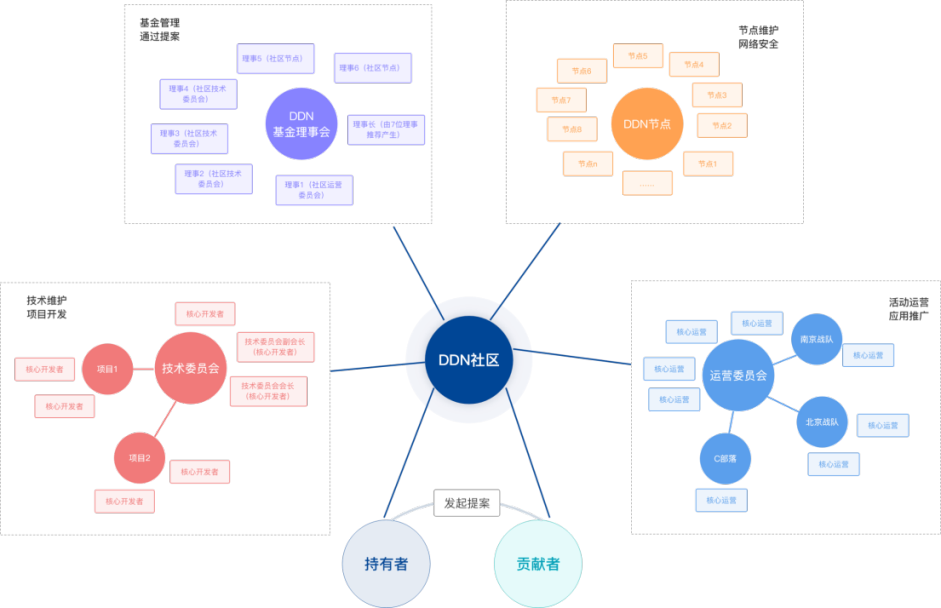
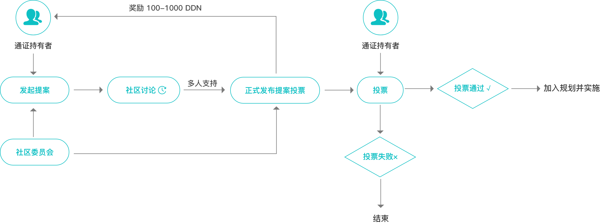
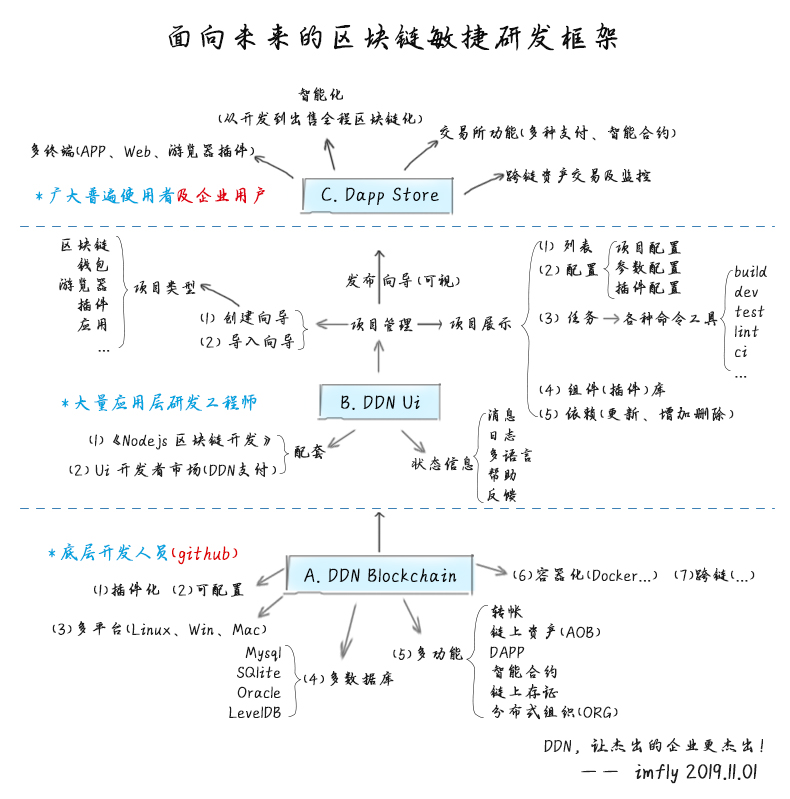

DDN社区管理绿皮书

DDN社区发展规划与安排
---------------

v1.0.pre

DDN 基金会

2020年2月18日

## 目录

- [DDN社区发展规划与安排](#ddn%e7%a4%be%e5%8c%ba%e5%8f%91%e5%b1%95%e8%a7%84%e5%88%92%e4%b8%8e%e5%ae%89%e6%8e%92)
- [目录](#%e7%9b%ae%e5%bd%95)
- [DDN社区发展概览](#ddn%e7%a4%be%e5%8c%ba%e5%8f%91%e5%b1%95%e6%a6%82%e8%a7%88)
- [DDN社区管理委员会](#ddn%e7%a4%be%e5%8c%ba%e7%ae%a1%e7%90%86%e5%a7%94%e5%91%98%e4%bc%9a)
  - [组织架构](#%e7%bb%84%e7%bb%87%e6%9e%b6%e6%9e%84)
  - [提案流程](#%e6%8f%90%e6%a1%88%e6%b5%81%e7%a8%8b)
  - [资产管理](#%e8%b5%84%e4%ba%a7%e7%ae%a1%e7%90%86)
    - [1. DDN社区基金来源](#1-ddn%e7%a4%be%e5%8c%ba%e5%9f%ba%e9%87%91%e6%9d%a5%e6%ba%90)
    - [2. 基金会账户管理方法](#2-%e5%9f%ba%e9%87%91%e4%bc%9a%e8%b4%a6%e6%88%b7%e7%ae%a1%e7%90%86%e6%96%b9%e6%b3%95)
    - [3. DDN社区基金使用规则](#3-ddn%e7%a4%be%e5%8c%ba%e5%9f%ba%e9%87%91%e4%bd%bf%e7%94%a8%e8%a7%84%e5%88%99)
- [DDN区块链技术研发](#ddn%e5%8c%ba%e5%9d%97%e9%93%be%e6%8a%80%e6%9c%af%e7%a0%94%e5%8f%91)
  - [关键技术突破](#%e5%85%b3%e9%94%ae%e6%8a%80%e6%9c%af%e7%aa%81%e7%a0%b4)
  - [应用技术突破](#%e5%ba%94%e7%94%a8%e6%8a%80%e6%9c%af%e7%aa%81%e7%a0%b4)
- [DDN社区运营管理](#ddn%e7%a4%be%e5%8c%ba%e8%bf%90%e8%90%a5%e7%ae%a1%e7%90%86)
  - [1. DATM 社区工具推广](#1-datm-%e7%a4%be%e5%8c%ba%e5%b7%a5%e5%85%b7%e6%8e%a8%e5%b9%bf)
  - [2. 101计划](#2-101%e8%ae%a1%e5%88%92)
    - [a. 101节点计划](#a-101%e8%8a%82%e7%82%b9%e8%ae%a1%e5%88%92)
    - [b. 101社区计划](#b-101%e7%a4%be%e5%8c%ba%e8%ae%a1%e5%88%92)
    - [c. 101激励计划](#c-101%e6%bf%80%e5%8a%b1%e8%ae%a1%e5%88%92)

## DDN社区发展概览

自2017年12月12日《DDN白皮书——一个面向企业的区块链系统》发布至今，已经历时2年2个月。这段时间，DDN区块链技术发生重大飞跃，从1.0，到2.0，再到当前的3.0，每一次都是一个全新迭代，模块化更加细化，研发体系初见成效，可视化造链工具已成系列，智能合约从链上资产到侧链应用全部覆盖，TPS突破8000，“多链并行，跨链互通”基本实现，从技术上被社区称为“中国的Cosmos”。

DDN区块链生态快速建成，立足“区块链+实体”的企业服务方向，基于DDN区块链技术衍生出的企业级区块链产品逐个落地，文创版权、知识分销、检验检测、政府监管、智慧旅游、电子医疗、智慧社区、券式系统、智慧销售、智慧微网等已经延伸到诸多行业，悄无声息的影响着大众生活。

DDN社区运营健康发展，技术社区仍占主导地位，旧版《Node.js区块链开发》的github关注量达到2162个，正式版书籍出售数量超过30000本，第二版正式启动，基于新版DDN的代码体系和最新语言规范，面向技术的远程培训体系（DDN-UBL 大学实验课程）构建完成，将会迎来技术社区的再次爆发，为DDN区块链的生态贡献更多技术支撑；运营社区稳步推进，基于微信群、QQ群、Telegraph等工具的用户数量达到20000多人，随着社区管理工具（DATM）的成熟和“共享员工”理念的深入，有望迎来社区人员的暴增。

总之，两年多来，在世界经济急速下行、政府监管十分严苛的大环境下，DDN基金会、区块链技术方、社区成员，面对社会各种噪杂的声音，抵制诱惑，坚守初心，通过新技术的突破，积极传播分布式协作的社区文化，社区发展开放、有序、健康。

但是，不可否认，2017年来的这两年，受大环境影响，与大部分区块链社区类似，DDN的社区发展也不尽如人意，运行规则不够清晰、人员规模不够大、社区活跃度不够高等等，这些问题大家都在思考如何解决，DDN社区也希望从自身优势出发，发挥技术带动作用，让社区发展再上一个新台阶。

《DDN白皮书——一个面向企业的区块链系统》的第11部分，是未来发展路线图，当初仅仅提供了一个粗线条规划提纲，提出了未来社区发展的目标，让DDN全面服务人类生活，实现“三无”（“去中心、去组织、去管理”）的社会形态，更多内容并没有设计好，今天，经过这两年的思考和实践，我们就全面细致的展现出来。

是为DDN社区管理《绿皮书》正式版序。

## DDN社区管理委员会

### 组织架构

社区自治由基金会组织规划，DDN基金会是一个非盈利组织，目的是服务于社区发展。DDN社区包括如下运作机构、节点和角色：

- 基金委员会：负责资产的管理和发放、提案的正式发起和通过，不涉及具体的项目和行为；
- 技术委员会：负责DDN区块链的技术研发和设计，负责技术社区的文档维护，负责技术人才的招募和培训；
- 运营委员会：负责DDN社区运营，及相关产品的运营，负责具体的运营计划的设计和实施；
- 项目组：负责某个具体项目或活动的组织实施；
- 节点：负责维护区块链网络，参与落实技术、运营等社区工作，享受节点相关奖励；
- 贡献者：DDN社区任何一位持有DDN的用户、使用DDN技术的用户、参与运营推广的用户等，都是DDN社区贡献者，都是社区激励规则覆盖的范围。

### 提案流程

DIP提案将在 DATM 上发起，并在区块链上通过智能合约进行存证和处理。

### 资产管理

公开、透明、社区化决策。

#### 1. DDN社区基金来源

a. 原始激励

为确保社区永续健康发展，DDN区块链创世奖励的部分DDN，归基金会支配，作为原始发展基金用途。当前社区账户状况

* 总额：1.285 亿
* 社区剩余：7000万左右
* 运营中账户：500万左右
* 总流通量：4000万左右
* 市场流通量：2000万左右
* 计划销毁：2850万左右（保持1亿不变）

b. 商业盈利

DDN良好的扩展开发能力，要求使用者通过支付或抵押少量DDN的方式构建新链、发行新资产、打造新的去中心化应用（Dapp），这一切都将通过DDN开发框架自动完成。作为一种提案（DIP），初步设定的标准是：

* 构建新链：质押 100,000 DDN;
* 打造Dapp：质押 1,000 DDN;
* 发行新资产：质押 500 DDN;
* 使用钱包、浏览量模块、模板等现有开发组件，10-100 DDN；
* 参与DDN-UBL在线学习，支付 5,000 DDN；

c. 社会捐赠

社区接受来自社会各方的捐赠，各界人士可捐赠 DDN，捐赠收入用与维持社区活动或分发任务、开发奖励等。

#### 2. 基金会账户管理方法

* 锁仓账户，每个账户1000万，并进行锁仓，按年释放；
* 基金会活跃账户（多重签名3/7，由基金会管控，至少3人签名通过）；
* 基金会特殊账户（如未来的慈善账户，特殊用途账户，从活跃账户转出）；
* 技术总账户：一个，由DDN技术负责人负责监管和分发；
* 运营总账户：一个，由DDN运营负责人负责监管和分发；
* 节点奖励账户：一个，由节点负责人监管和分发，除区块奖励（系统内置）外，通过stack技术完成DDN持有奖励，未来用户可以锁仓参与某个节点管理，并国通节点代为投票并获取奖励，系统自动分成DDN；

#### 3. DDN社区基金使用规则

所有未使用的DDN由社区基金会管理，全部按计划锁仓，逐年释放，一旦释放后，转入基金会活跃账户，若基金会有收入，也转入到活跃账户，并备注来源和支出情况，通过网络即时公开。

所有技术总账，运营总账，节点奖励的金额都来自基金会活跃账户，所有公开账户支出需备注用途，具体的任务运营支出，通过DATM管理。DATM账户，归属运营总账。

不定期进行适量销毁，将节点奖励溢价的部分销毁，确保DDN总量保持在1亿规模。

## DDN区块链技术研发

原则：坚持用区块链技术解决社区发展中的一切问题！

### 关键技术突破

**共识机制** 针对共识机制、应用范围等进行创新性研究，推出具有标志性的突破，推出更具实用性的共识机制，进一步大大提升TPS的交易算法；通过智能合约，优化节点奖励机制，让社区成员都能参与到节点投票和获益中去，扩大社区凝聚力。

**载波技术** DDN是数据分发网络，遍布世界的节点、轻节点和客户端，组成了一个高效的网络，基于该网络的数据分发，可以通过DDN的智能寻址技术，快速抵达对应网址所构建的节点或终端，类似地震冲击波，悄无声息到达对方。DDN网络相当于载波，发送的数据称为载荷，因而此技术称为载波技术。该技术适用于那些场景呢？比如：即时聊天、社交软件、视频应用等，具有即时信息传递的场景。

### 应用技术突破

DDN区块链是面向企业的区块链系统，其开发框架遵从敏捷开发思想，目前已经实现诸多功能，主要特点包括：

- [x] **成熟**, 已经服务于多个企业级区块链系统;
- [x] **文档齐全**, 简单、快速、门槛低，开发前请参考书籍[《Nodejs区块链开发》](https://github.com/imfly/bitcoin-on-nodejs);
- [x] **可配置**, 你可以通过参数配置自己的节点数量、token名称等;
- [x] **插件化**, 良好的扩展性，可以让你快速开发实现你自己的需求;
- [x] **多平台**, 你可以在Linux、Win或Mac平台上进行开发部署，不过还是建议使用Linux系统;
- [x] **多数据库**, 你可以使用Mysql, SQLite, Oracle, 等主流数据库系统;
- [x] **多功能**, 支付转账、数据存证、链上资产（AoB）、去中心化应用（DAPP）等强大功能;
- [x] **多行业**, 当前已经覆盖版权保护、电子医疗、食品安全、防伪溯源等众多领域;
- [x] **可视化（内测）**, 你可以通过点点鼠标定制自己的区块链并部署到节点服务器上去;
- [x] **Docker化**, 支持docker、云部署等更多主流部署方式;

技术架构和规划如下：

目前，没有那个产品能够称其为“开发框架”，没有细致的模块化架构、没有完善的文档支持、没有对应的开发工具支持，是没有办法支撑快速开发产品逻辑的，所以，一个区块链开发框架，必须具备自我扩展和自我增长的能力与体系。与现有几个平台对比如下：

| 对比内容 | DDN（数据分发网络）|BTC（比特币）|	ETH（以太坊）|	Fabric（超级账本）|
|---------|------------------|-----------|------------|------------------|
| 成熟度   | 稳定运行	      |  稳定运行   | 稳定运行     | 稳定运行         |
| 产品定位 | 	企业级应用     |  虚拟货币	| 虚拟货币  	|  联盟应用（无币） |
| 应用范围 | 	企业实体      |	数字货币	| 数字货币      |	企业应用      |
| 适用类型 | 适用于公链、联盟链、私有链|公链 |	公链	| 联盟链 |
| 编程语言 | 	Node.js/Javascript |	C/C++ |	Go	| Go |
| 共识机制 | 	DPOS+PBFT |	POW |	POW+POS |	Kafka |
| 总体性能 | 	高 |	非常低 |	低 |	低 |
| 扩展性   | 好，可视化定制 | 差，定制难度大 | 差，定制难度大 | 较好，自行定制 | 
| 模块化   | 支持 |	不支持 |	不支持 |	不支持 |
| 友好度   | 开发友好高效	| 二次开发难度大 |	二次开发难度大 |	相对友好 |
| 产品生态 | 	好 |	单一 |	单一 |	好 |
| 学习门槛 | 	低	| 高	| 高	| 高 |
| 配套书籍 | 	有，核心开发者提供 |有，社区爱好者提供 |有，社区爱好者提供|	有，社区爱好者提供|

截止目前，DDN区块链已经建立起技术、应用、培训、人才、社区5个方面立体化的生态体系，为即将到来的爆发奠定了很好的基石。

## DDN社区运营管理

DDN区块链生态体系中，DDN类似于 Cosmos 的 Atom (权益抵押代币)，而且始终维持在1亿的规模，所以对比 Atom，DDN 的价值当前被市场严重低估，随着社区的进一步推广，它的价值将被进一步凸显。

### 1. DATM 社区工具推广

DDN为自治社区、自治组织而生，为了更好的支撑其他理念目标的实现，我们将管理逻辑通过代码进一步实现，推出了 DATM——分布式自治组织管理工具，该工具以 DDN 为平台通证，面向BTC、ETH等所有的社区免费开放，最终将集成即时通讯、社区管理、项目管理、任务分发、任务智能匹配、区块链钱包+理财、技能认证、技能分享、虚拟空间、远程办公、游戏活动等功能。

DDN的运营，将把DATM作为载体工具，推出如下活动：

系统活动（内嵌到App整体功能里面）

- 每日签到：增加活跃度；
-  系统任务奖励+引导（刚注册的人通过奖励引导他们体验App，领取任务，加入社区，创建项目，完成任务）；
- 采蜜活动：定期发放DDN奖励，每天定额，以后可以发放其他糖果，其他社区Token也可以作为宣传媒介进行发放，每采蜜一次，就会自动弹出对应宣传内容；
- 理财活动：其他社区通证空投，DDN定存奖励等；
- 合伙人计划：三级邀请机制，第一级：邀请他人加入即可获得即时奖励，第二级：被邀请人在DATM 上的消费10%的提成给邀请人，对于额外完成任务的还有累计奖励；
- 推出“共享员工”大礼包，大量招募失业的员工入驻，给其技能展示和存证；大量招募小微企业入驻，特别是那些有大量外勤工作的企业，DATM为其服务并提供“共享员工”。

### 2. 101计划

#### a. 101节点计划

目前，作为抵押网络，DDN网络核心节点共计101个，排队等候投票的节点达到200多个，为了更好的优化节点管理，让更多人参与并从中获取收益，上面提到，DDN社区已将共识算法改进纳入重要意思日程。当前，任何成员只要持有并锁仓20万DDN都有机会获得社区投票，并进入前面挖矿的行列。

#### b. 101社区计划

通过 DATM 招募 101 家创世社区，条件：

* 社区成员满 10 人，社区基础信息完善（可以是DDN，ETH，BTC，上自己的币，需要额外对接）
* 累计社区支出满 0.2 个BTC，累计发布任务超过 10 个；
* 微信群、微博、公众号等公告 DATM 协作平台及其社区邀请二维码；
* 与 DATM 联合宣传；

福利：

* 给予获得 DATM 永久VIP和创世社区称号，免费使用所有基础功能和会员付费功能（增值服务除外）；
* 品牌展示，在 DATM 空间及相关活动中可不定期展示其Logo信息；
* 虚拟空间中创世社区LOGO品牌露出；
* 未来免费拥有一个数字虚拟社区；
* 社区 Token 优先支持；
* 联合发声时的品牌露出；
* 价值 5000 DDN 优惠券, 用于购买 DDN 相关产品服务，消耗完为止；

#### c. 101激励计划

为了吸引和鼓励更多人和企业加入，DDN社区还将组织各类联合活动，比如：101媒体激励计划，101平台激励计划，101名人激励计划等。开放、包容、自由，是DDN社区的精神所在，能用技术和规则完成的事情，都将 DDN区块链 或 DATM 应用中集中展现。

专业铸就卓越，创新引领未来。DDN社区与您，不见不散。