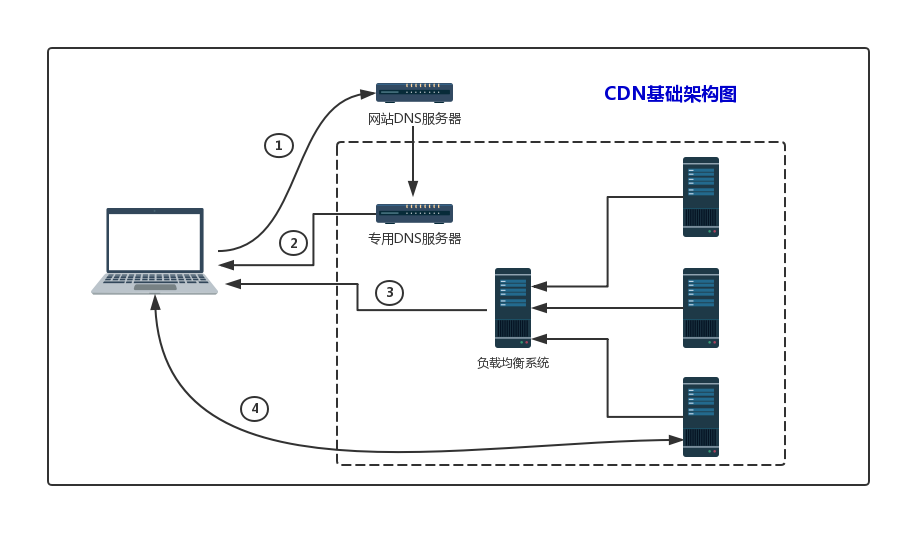

DDN白皮书
-------

v0.0.1

（本白皮书仍在持续修改完善中...）

## 1.概要
DDN（Data Delivery Network），是新一代数据分发网络，是CDN（Content Delivery Network）的升级版。传统的CDN网络，能够实时地根据网络流量和各节点的连接、负载状况以及到用户的距离、响应时间等综合信息，将用户的请求重新导向离用户最近的服务节点上，从而避开互联网上有可能影响数据传输速度和稳定性的瓶颈与环节，使内容传输的更快、更稳定。但是CDN针对的是中心化的服务，而且使用范围有限制，部署条件复杂，综合成本较高，对数据分发传输的效率提升有限。DDN网络基于区块链，从网络寻址、负载均衡、数据分发等各个环节，都大大简化，而且适于用户个人的任何数据，同时基于区块链公开、透明、可追溯的特点，兼具用户隐私保护、数据存证、知识变现、数据安全等诸多优点。本白皮书描述了DDN的概念和由来，分析了当前互联网存在的问题，整理了DDN解决的痛点，提出了具体的解决方案，并从商业层面，提出了未来推进的路线图。

## 2.概念

**Data Delivery Network**，DDN，数据分发网络，充分利用区块链技术进行存储、索引、检索和寻址，实时地将一端用户的数据快速准确传输到另一端用户，从而最大限度地避开基于TCP/IP网络的限制，使数据传输更安全、更准确、更快速。

**Directional Data**，DD，定向数据，DDN网络中传输的数据，包含传统网络中的任何形式，数字、文本、图片、音视频等，区别于传统网络的是，这些数据通过区块链存证功能，从诞生开始就有了权属，未来的转移会被完整记录，有始有终。

**Data Transaction**，DT，数据交易，数据在DDN网络中的每一步流转，都是一次交易行为。我们认为，在数字世界，任何数字形式的变更或转移，都应该有价值呈现或转移，因此DDN是一个价值网络，倡导每一次数据交易都需要付费。

**Data Addressing Protocol**，DAP，数据寻址协议，基于区块链的DNS协议，有效避开传统互联网的寻址方式，快速定位数据来源，并提供最近访问节点。

**Data Storage Protocol**，DSP，数据存储协议，基于P2P网络的数据存储方式，保证了数据存储的安全、便捷，以及提取数据的快速。

**Data Delivery Protocol**，DDP，数据点对点分发协议，区别于CDN那种基于中心化的服务器分散式分发的方式，DDN基于P2P网络，可以做到点对点分发，既保证访问的速度，也可保证被泄露，从而更安全。
## 3.背景

DDN的目标是要成为现有互联网的根基，
### 3.1 互联网的初衷是资源互联

Tim Berners-Lee是万维网的发明人，被称为“万维网之父”，他反复重申WWW的初衷是作为创意和效率的工具，提供使用者更好的共事与资讯获取的交流环境，更直白的表述就是一个资源互联的网络，其本质就是开放（Open）与去中心化（Decentralized）。

但目前，随着WWW商业化的程度越来越高，基于商业目的，很多产品互相竞争与阻隔，资源互联成为商业掠夺的圣地，一个个数据霸主诞生，中心化的趋势越来越高，开放、互联、效率与创始者的初衷背道而驰，让创始者始料未及，十分遗憾。

### 3.2 CDN的弊端

在互联网飞速发展的今天，快速增长的内容与有限的带宽形成鲜明的矛盾，为了解决这个问题，提高网站浏览速度，提升用户使用体验，CDN技术应运而生。不可否认，CDN技术给当前的互联网增添了翅膀，解决了很多现实问题，让互联网的发展更加快速。

但是，互联网是资源互联，CDN仅仅解决了小部分问题，未来即时应用的场景将越来越多，CDN是建立在缓存基础上的，显然不适用；对于分布式场景，基于区块链的数据访问将更加普遍，对中心化网站提速的CDN将无用武之地。
### 3.3 Ebookchain的体验亟待提升

2015年以来，亿书始终坚守“让有知识的人富起来”这一神圣使命，积累技术、磨砺产品，先后迭代更新4个大的版本，终于完成了《亿书白皮书》2.0全部需求，初步实现产品落地。

截至今日，亿书成为:

* 第一个提出并践行用区块链进行版权保护的；
* 第一个严格执行白皮书并实现产品落地的；
* 第一个面向C端用户，走进寻常百姓的；
* 第一个具备文档、代码、产品和培训全面布局的；
* 第一个可以进行商用并零成本服务行业的。

但是，受制于当前的网络环境、节点的数量和服务能力等等软硬件条件，亿书的使用体验受到限制，存证、浏览、检索、交易都没有达到让用户十分满意的效果，所以亿书团队果断与DDN签约，将全部的架构逻辑转移到DDN之上，提高IP资源的转移效率。

## 4.基础架构

### 4.1 CDN的基本架构。

最简单的CDN网络，由一个DNS服务器、一台负载均衡器和几台缓存服务器组成，其核心就是负载均衡与内容缓存。用户请求网络时，需要提供自身请求的IP，以及请求的资源地址URL，CDN网络最先使用专用的DNS服务器找到全局负载均衡设备，然后根据用户IP判断最快最近的缓存服务器，最后根据用户请求的URl找到相关资源，返回给用户。其基本架构如图：

关键技术包括：

内容发布：建索引、缓存、流分裂、组播（Multicast）等技术；

内容路由：网络负载均衡技术，通过内容路由器中的重定向机制，在多个远程POP上均衡用户的请求，以使用户请求得到最近内容源的响应；

内容交换：它根据内容的可用性、服务器的可用性以及用户的背景，在POP的缓存服务器上，利用应用层交换、流分裂、重定向（ICP、WCCP）等技术，智能地平衡负载流量；

性能管理：它通过内部和外部监控系统，获取网络部件的状况信息，测量内容发布的端到端性能（如包丢失、延时、平均带宽、启动时间、帧速率等），保证网络处于最佳的运行状态。

### 4.2 DDN的基本架构

DDN网络以区块链节点服务器为核心组成。整个网络由多条区块链组成，每条区块链由多于101个节点服务器构成，整个网络的节点服务器的数量远大于 N*101（N为区块链数量）。这些节点服务器自带负载均衡能力。用户提供IP和请求数据的URL，每个节点都会承担均衡器的角色，把就近的节点服务器提供给用户，最后把用户请求的URL内容返回给用户。基本架构如图：

对比CDN，其关键技术包括：

数据存储：区块链技术，通过DPOS共识算法，构建健壮安全的P2P网络；基于P2P网络存储文字、图片、音视频等重要内容，并使用分布式协议提供用户浏览。

数据路由：网络负载均衡技术，根据自身负载综合调度和分配用户请求到附近网络，最终为用户提供最近节点；

数据交换：根据数据特征，直接对区块链进行具名检索，快速获得对应的内容；

性能管理：服务器节点自我诊断，自我管理，即时监测网络变化，踢出停机节点，保证网络整体性能和最佳运行状态。

### 4.3 DDN的优势

**即时应用，无缓存**，与CDN的根本区别就是，DDN极少用到缓存，只有在用户客户端开启的那一刻，会将请求数据的最近资源列表或内容缓存，以获得极致体验，其他时候都是即时为主，内容时刻都是最新的。

**适用范围更广**，CDN适合大型中心化网络服务提供商使用和部署，内容也是Web网站为主，DDN面向的是用户个人生产发布的各类数据，以及各类交易和授权操作。 

**成本更加低廉**，DDN除了即时、快速、高效、简单的特点，比起CDN成本也相对节省很多。基于DDN，用户可以非常简单的构建自己的去中心化网站、博客等内容分发平台，使用和体验相同的情况下，成本几乎为“0”。
## 5.核心技术

在Ebookchain的基础上，DDN将持续添加更多核心技术。
### 5.1 区块链

《亿书白皮书》2.0已经详细描述了DDN区块链的基本功能，目前运行的DDN主网也已经基本实现了这些功能。下一步，将不断完善分布式算法，进一步提高单链的处理性能；适时引进DAG（有向无环图）技术，让链上交易更加适应大规模、高频次的计算需求。同时，对于DDN网络而言，进一步增加和完善如下功能：

#### 5.1.1 跨链技术

DDN网络将在完善侧链基础之上，把跨链进一步延伸，实现多条链的互访。原则上，侧链是锚定在某条主链之上的一个应用，主链消失，侧链也将不再存在。但是，跨链技术没有主侧之分，某一条链消失不会影响另一条链的存在，数据也不会受到任何影响。基本原理如图所示：

#### 5.1.2 智能合约

区块链对智能合约的支持是多样化的。DDN的侧链技术安全、稳定，可以支持更多的Dapp的开发，实现相对复杂的智能合约逻辑，但是对使用者要求较高，需要具备一定的技术能力。因此，未来将添加一个对代码合约的直接支持，让用户针对某些场景，通过定制即可产生一段可运行的智能合约代码，从而降低智能合约使用难度，提高DDN使用的范围，特别是对未来物联网的支持更加简单、广泛。
#### 5.1.3 移动钱包

DDN提供了PC端的钱包设计，把钱包功能融入了产品之中，下一步将单独提供钱包功能，覆盖PC端和移动端，让用户对资产的管理更加方便，让开发者对钱包功能的集成使用更加简单直接。

### 5.2 可视化监控与部署

DDN区块链由无数条公链、私链和联盟链组成，节点数量众多，管理、监控、维护是一项极为挑战性的工作，为了确保整个网络的安全高效，必须实现节点的自我管理，同时提高节点所有者对节点的管控，并在可视化部署和管理上做到极致。同时，不排除使用更多的协议扩展核心P2P网络。
### 5.3 具名路由

分布式网络、智能寻址、资产化等是DDN网络的基本组成部分，具名路由可以将这些有效关联起来，简化用户操作，提高索引效率和检索速度。具名路由会把用户资产、区块链、数据和资源URL有效统一起来，在节点负载均衡、智能寻址的基础上，实现完整的超越CDN的完美体验。
### 5.4 智能网盘 

DDN网络的演进和发展需要一定的过程，用户对个人数据存储的需求多种多样，为了弥补发展过程中，节点部署慢、分布不均匀等弊端，满足用户更多的个性化需求，DDN将进一步完善分布式存储算法，提高分布式网络使用体验；进一步优化文件存储协议，提高存储效率和安全性；推出数据矿机、智能网盘等硬件设备，提高个人存证安全性；通过硬件补偿，增加更多网络节点，增强DDN网络寻址效率。

## 6.商业布局

DDN的目标是从互联网的底层开始，打造下一代价值互联网，让区块链的部署“0”成本。DDN单链部署的简化，链链之间的互访，以及侧链的扩展能力，为商业上的快速扩张奠定了良好基础。

目前，DDN已经与亿书、LimsChain、艺术品管理系统等产品方签约，在文字、影视、艺术品等文娱行业全面布局，在物联网、医疗、金融、供应链等领域全面展开，规模化的生态系统初见规模。

### 6.1 技术孵化

接下来，DDN将采取技术孵化的模式，进一步加快推进。任何一家从事对区块略有需求的实体，只要具备优质的资源和较强的运营能力，就可以采取如下方式为得到DDN的技术支持和服务：

* 质押锁仓不超过10%的DDN
* 支付同比例的新数字资产作为技术服务费用；
* 从DDN全球社区和学员中招募人才组建维护和开发团队，或者组建专业团队，DDN提供技术培训。

更多其他事宜，视需求不同具体商议。

### 6.2 自治社区

DDN全球社区建设的目标是“**无中心、无组织、无管理**”（“三无”目标），规则来自于全球社区，管理通过专用的社区链管理系统进行，5年内实现社区管理自治，不受团队、企业或项目方等任何参与者左右。

修改完善推出DDN社区管理《绿皮书》正式版，面向全球招募开发、运营、管理和翻译团队，研发社区链管理系统，对技术研发、运营管理等各项工作都要写入区块链，为DDN做出贡献的，都会直接获得DDN奖励。

### 6.3 宣传推广

* 组织行业会议

联合DDN孵化的合作企业或行业内的企业，共同组织各类专业的行业会议，宣传推广DDN落地方案，打造更多落地应用，催生更多优质的IP或企业，让DDN的各链都成为货真价实的资产链，让上资产更具价值。

* 组织技术研讨

继续定期组织区块链茶座、区块链极客论坛等属于DDN的活动品牌，普及区块链知识和理念，传播技术落地的经验，一起探讨未来方向，研究解决方案，面向未来不断升级DDN各项技术，让DDN始终保持行业领先地位。

* 做好技术培训

DDN已与国内知名的线上培训机构达成战略合作，将对DDN链及其应用等进行系统培训，为行业，特别是合作伙伴提供紧缺的区块链研发人才。用DDN培养人才，用人才服务企业，让企业低成本使用区块链。

## 7.路线图(待)

### 7.1 第一阶段

优化DDN现有代码，提高性能和稳定性；宣传推广DDN，打造国际化社区；

### 7.2 第二阶段

升级DDN核心链，联通其他各链，建成面向全球的数据分发网络；

### 7.3 第三阶段

基于DDN研发各类商业模式，让DDN全面服务人类生活，实现“三无”目标，DDN团队消失或淹没在社区中。

## 参考资料

* [亿书白皮书](http://ddn.link/static/download/ebookchain.pdf)
* [Tim Berners-Lee](https://baike.baidu.com/item/蒂姆·伯纳斯·李/8868412?fr=aladdin)
* [历史上第一个网站](http://info.cern.ch)
* [The birth of the web](https://home.cern/topics/birth-web)